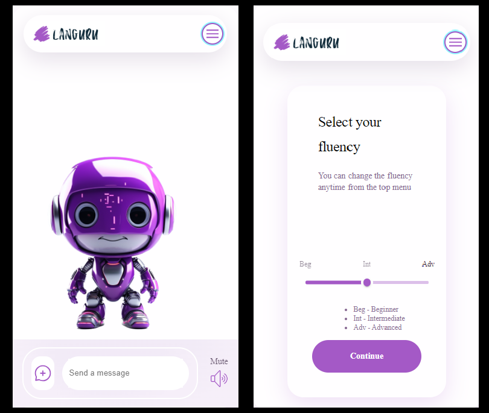

# Fluent AI for Mandarin Chatbot

Welcome to the Fluent AI for Mandarin Chatbot repository. This project leverages React for the frontend and Python FastAPI for the backend.



## Overview

This project enables voice and text-based chat functionalities for users to practice Mandarin vocal skills. Users can interact with the chatbot through both text-based and voice-based communication.

## Features

- **Voice-to-Text Conversion**: Voice data input by the user is transformed into text using the Deepgram API.
- **Chatbot Integration**: The chatbot, powered by OpenAI, engages in conversations with users and provides responses.
- **Speech Output**: Responses from the chatbot are converted back to speech using the ElevenLabs API.
- **Pronunciation Evaluation**: Users can estimate their vocal skills and receive feedback on the correctness of their pronunciation.

## Usage

1. Clone the repository:
   ```
   git clone https://github.com/xfactor-toml/fluentai_mandarin.git
   ```

2. Install dependencies for both the frontend (React) and backend (Python FastAPI).

3. Run the application and access the chatbot interface to start practicing Mandarin vocal skills through voice and text interactions.

## Contribution

Contributions to enhance the functionality and features of the Fluent AI for Mandarin Chatbot project are welcome. Feel free to submit pull requests with your improvements.

## License

This project is licensed under the [MIT License]

---
Feel free to include this content in your ReadMe file in the GitHub repository.
